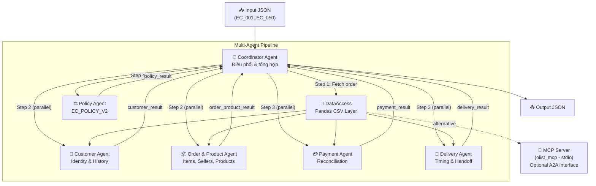

# Architecture - Multi-Agent E-commerce Dispute Resolution

## Tổng quan hệ thống

Hệ thống multi-agent xử lý 50 case khiếu nại thương mại điện tử trên dữ liệu Olist.
Mỗi case được điều tra bởi 6 agent chuyên biệt, phối hợp qua **Coordinator Agent**.

---

## Sơ đồ agent



---

## Chi tiết vai trò từng Agent

### 1. Coordinator Agent (`coordinator_agent.py`)

| Thuộc tính          | Giá trị                                    |
| ------------------- | ------------------------------------------ |
| **Vai trò**         | Điều phối pipeline, tổng hợp output        |
| **Quyền truy cập**  | Tất cả (qua DataAccess)                   |
| **Input**           | Case JSON từ thư mục `input/`              |
| **Output**          | Case JSON vào thư mục `output/`            |

**Luồng xử lý:**
1. Đọc input JSON, lấy `claimed_order_id`
2. Fetch order data từ DataAccess
3. Chạy **song song** CustomerAgent + OrderProductAgent
4. Chạy **song song** PaymentAgent + DeliveryAgent (cần kết quả step 3)
5. Chạy PolicyAgent (cần tất cả kết quả)
6. Assemble CaseOutput, ghi file JSON

### 2. Customer Agent (`customer_agent.py`)

| Thuộc tính          | Giá trị                                    |
| ------------------- | ------------------------------------------ |
| **Vai trò**         | Xác định danh tính & lịch sử khách hàng   |
| **Quyền truy cập**  | `customers`, `orders`                      |
| **Input (context)** | `order_id`, `order_data`                   |
| **Output**          | `customer_unique_id`, `related_order_ids`, `is_repeat_customer` |

### 3. Order & Product Agent (`order_product_agent.py`)

| Thuộc tính          | Giá trị                                    |
| ------------------- | ------------------------------------------ |
| **Vai trò**         | Phân tích items, products, sellers          |
| **Quyền truy cập**  | `order_items`, `products`, `sellers`, `category_translation` |
| **Input (context)** | `order_id`                                 |
| **Output**          | Items, products, sellers, categories, secondary issues (`multi_item`, `multi_seller`, `multiple_categories`) |

### 4. Payment Agent (`payment_agent.py`)

| Thuộc tính          | Giá trị                                    |
| ------------------- | ------------------------------------------ |
| **Vai trò**         | Đối soát payment                           |
| **Quyền truy cập**  | `order_payments`                           |
| **Input (context)** | `order_id`, `items` (từ OrderProductAgent)  |
| **Output**          | Payment totals, reconciliation, `split_payment` flag |

**Công thức:**
```
expected_total = sum(price) + sum(freight_value)
difference = payment_total - expected_total
reconciled = abs(difference) <= 0.10
```

### 5. Delivery Agent (`delivery_agent.py`)

| Thuộc tính          | Giá trị                                    |
| ------------------- | ------------------------------------------ |
| **Vai trò**         | Phân tích giao hàng & seller handoff       |
| **Quyền truy cập**  | `orders` (timestamps), `order_items` (shipping_limit) |
| **Input (context)** | `order_id`, `order_data`, `items`          |
| **Output**          | Delivery variance, handoff analysis, late delivery type |

**Công thức:**
```
delivery_variance_hours = delivered_customer_date - estimated_delivery_date
handoff_variance_hours = delivered_carrier_date - shipping_limit_date
```

### 6. Policy Agent (`policy_agent.py`)

| Thuộc tính          | Giá trị                                    |
| ------------------- | ------------------------------------------ |
| **Vai trò**         | Áp dụng EC_POLICY_V2                       |
| **Quyền truy cập**  | Kết quả từ tất cả agent khác              |
| **Input (context)** | Tất cả `*_result` từ 4 agent trên         |
| **Output**          | primary_issue, secondary_issues, root_cause, refund, actions |

---

## Luồng Handoff

```
┌─────────────────────────────────────────────────────────────┐
│                    Coordinator Agent                        │
│                                                             │
│  1. Read Input ──► Fetch Order Data                         │
│                        │                                    │
│  2. ┌─────────────────┼─────────────────┐                  │
│     │                 │                 │                    │
│     ▼                 ▼                 │                    │
│  Customer Agent   Order&Product Agent   │                    │
│     │                 │                 │                    │
│     ▼                 ▼                 │                    │
│  customer_result  order_product_result  │                    │
│     │                 │                 │                    │
│  3. ├─────────────────┤                 │                    │
│     │                 │                 │                    │
│     ▼                 ▼                 │                    │
│  Payment Agent    Delivery Agent        │                    │
│     │                 │                 │                    │
│     ▼                 ▼                 │                    │
│  payment_result   delivery_result       │                    │
│     │                 │                 │                    │
│  4. └────────┬────────┘                 │                    │
│              ▼                          │                    │
│        Policy Agent                     │                    │
│              │                          │                    │
│              ▼                          │                    │
│        policy_result                    │                    │
│              │                          │                    │
│  5. Assemble CaseOutput ──► Write JSON  │                    │
│                                         │                    │
└─────────────────────────────────────────────────────────────┘
```

---

## Data Access

### Direct Access (In-Process)
- `DataAccess` class (`data_access.py`) loads tất cả CSV vào pandas DataFrames
- Mỗi agent gọi phương thức query trực tiếp qua `self.data`
- Ưu điểm: nhanh, đơn giản, không cần network

### MCP Server (A2A Interface)
- `olist_mcp.py` cung cấp 8 MCP tools qua stdio transport
- Phục vụ cho tích hợp A2A hoặc external agent communication
- Tools: `olist_get_order`, `olist_get_order_items`, `olist_get_order_payments`, `olist_get_customer`, `olist_get_customer_orders`, `olist_get_product`, `olist_get_seller`, `olist_get_order_reviews`

---

## Cấu trúc thư mục

```
codebase/
├── __init__.py
├── config.py              # Configuration & paths
├── models.py              # Pydantic output schema models
├── llm_client.py          # OpenAI-compatible LLM wrapper
├── data_access.py         # Direct pandas CSV access
├── runner.py              # Main entry point
├── requirements.txt       # Python dependencies
├── agents/
│   ├── __init__.py
│   ├── base_agent.py      # Abstract base class
│   ├── coordinator_agent.py
│   ├── customer_agent.py
│   ├── order_product_agent.py
│   ├── payment_agent.py
│   ├── delivery_agent.py
│   └── policy_agent.py
└── mcp_server/
    ├── __init__.py
    └── olist_mcp.py       # FastMCP server (stdio)
```

---

## Công nghệ

| Component      | Technology                              |
| -------------- | --------------------------------------- |
| Language       | Python 3.10+                            |
| LLM            | ≤ 10B parameters (configurable)        |
| LLM SDK        | OpenAI Python SDK (compatible API)      |
| Data           | pandas DataFrames                       |
| Validation     | Pydantic v2                             |
| MCP            | FastMCP (Python SDK)                    |
| Async          | asyncio                                 |
